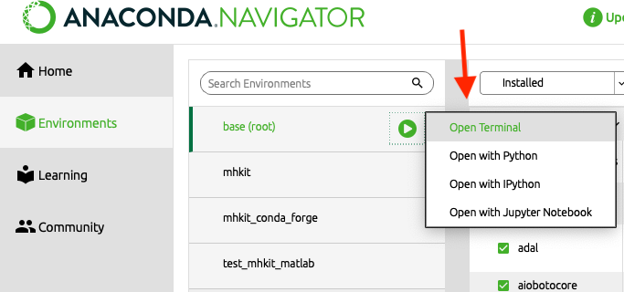

.. _python_installation:

MHKiT-Python Installation
=========================

The following sections include installation instructions for `MHKiT-Python <https://github.com/MHKiT-Software/MHKiT-Python>`_.

`MHKiT-Python <https://github.com/MHKiT-Software/MHKiT-Python>`_ requires `Python (3.8-3.11) <https://www.python.org/>`_  and has several Python package dependencies.
It is recommended to use `Conda <https://docs.conda.io/projects/conda/en/stable/index.html>`_ to install Python and MHKiT-Python since it includes most of MHKiT-Python's package dependencies.

Requirements
^^^^^^^^^^^^^^^
`MHKiT-Python <https://github.com/MHKiT-Software/MHKiT-Python>`_ requires `Python (3.8-3.11) <https://www.python.org/>`_ and has the following Python package dependencies:

* `Xarray <https://docs.xarray.dev/en/stable/>`_: used for data storage and analysis
* `Pandas <http://pandas.pydata.org>`_: used for data storage and analysis
* `NumPy <http://www.numpy.org>`_: used for data storage and analysis
* `SciPy <https://docs.scipy.org>`_: used for numerical methods, statistics, and signal processing
* `Matplotlib <http://matplotlib.org>`_: used to produce figures
* `Requests <https://requests.readthedocs.io/>`_: used to get data from websites
* `Pecos v0.1.9 <https://pecos.readthedocs.io/>`_: used for quality control analysis

Install MHKiT-Python
^^^^^^^^^^^^^^^^^^^^^

Option 1: Using Conda
"""""""""""""""""""""

For most users, `Conda <https://docs.conda.io/projects/conda/en/stable/index.html>`_ is the preferred choice for installing MHKiT-Python. Conda includes the ``conda`` command line utility to manage Python versions and dependencies within `environments <https://business-docs.anaconda.com/en/latest/user/environment.html#:~:text=An%20environment%20is%20a%20folder,from%20other%20collections%20of%20packages.>`_. Anaconda provides a standardized Python build environment that is compatible across operating systems, simplifying MHKiT-Python installation and setup for all users.

1. `Install Conda <https://docs.conda.io/projects/conda/en/stable/user-guide/install/index.html>`_ with Anaconda Distribution or Miniconda:

   - `Anaconda Distribution <https://docs.anaconda.com/anaconda/install/>`_ is a full featured installer that comes with a suite of packages for data science, as well as Anaconda Navigator, a GUI application for working with conda environments.
   - `Miniconda <https://docs.anaconda.com/miniconda/#quick-command-line-install>`_ is a minimal installer provided by Anaconda that installs the ``conda`` command line utility and its dependencies.

2. Access the Conda ``base`` environment:

Using Anaconda Distribution:

- Launch the "Anaconda Navigator" application

- Navigate to the "Environments" section

.. image:: ./figures/install_anaconda_select_environment_section.png
  :width: 500
  :alt: Navigating to the Anaconda Navigator "Environments" section

- Click the play button next to ``base(root)`` and select "Open Terminal"

Using Miniconda:

- Launch your preferred terminal and execute the following command:

.. code-block:: bash

  conda activate base

3. Download the most recent `MHKiT-Python conda environment file (environment.yml) <https://github.com/MHKiT-Software/MHKiT-Python/blob/master/environment.yml>`_

- Using the terminal

    - Execute the following command:

   .. code-block:: bash

      curl -o mhkit_environment.yml https://raw.githubusercontent.com/MHKiT-Software/MHKiT-Python/master/environment.yml

- Downloading the file manually.

    - Navigate to the `MHKiT-Python conda environment file (environment.yml) <https://github.com/MHKiT-Software/MHKiT-Python/blob/master/environment.yml>`_ and download using the "download" button (screenshot below). Move the downloaded file to the current folder in your terminal and rename the file to ``mhkit_environment.yml``

.. image:: ./figures/install_mhkit_python_env_yaml_download.png
  :width: 500
  :alt: Download MHKiT-Python environment.yml from GitHub

3. Download the most recent `MHKiT-Python conda environment file (environment.yml) <https://github.com/MHKiT-Software/MHKiT-Python/blob/master/environment.yml>`_

- Using the terminal

    - Execute the following command:

   .. code-block:: bash

      curl -o mhkit_environment.yml https://raw.githubusercontent.com/MHKiT-Software/MHKiT-Python/master/environment.yml

- Downloading the file manually

    - Navigate to the `MHKiT-Python conda environment file (environment.yml) <https://github.com/MHKiT-Software/MHKiT-Python/blob/master/environment.yml>`_ and use the "download" button to save the file to your local machine. Move the downloaded file to the directory where your terminal is currently open and rename it to ``mhkit_environment.yml``.

    .. image:: ./figures/install_mhkit_python_env_yaml_download.png
      :width: 500
      :alt: Download MHKiT-Python environment.yml from GitHub

4. Create a new environment using the downloaded environment file. In the terminal execute the following command:

   .. code-block:: bash

      conda env create --name <environment_name> -f mhkit_environment.yml

   Replacing ``<environment_name>`` with the desired name for your environment. Common convention is to call the MHKiT-Python environment ``mhkit``.

5. Install MHKiT-Python in the new environment. In the terminal execute the following commands:

   .. code-block:: bash

      conda activate <environment_name>

   .. code-block:: bash

      conda install -c conda-forge mhkit

  - To run the `MHKiT-Python example notebooks <examples.html>`_ please install the following additional dependencies:

       .. code-block:: bash

          pip install jupyter notebook folium utm

To verify your MHKiT-Python installation navigate to the `Verifying MHKiT-Python installation <#verifying-mhkit-python-installation>`_ section.

.. Note::
    To use MHKiT-Python in a new terminal activate the environment first by executing::

        conda activate <environment_name>

    With the anaconda environment activated your terminal prompt should show the environment name in parentheses, indicating that the environment is active. For example, it might look like::

        (env_name) user@machine:~$

Option 2: PIP Install from Python
"""""""""""""""""""""""""""""""""

To install MHKiT-Python using `pip <https://pip.pypa.io/en/stable/>`_::

    pip install mhkit

.. Note::
   The if the ``pip`` installation fails please try the installing MHKiT-Python with Anaconda

Option 3: Clone Repository from GitHub
""""""""""""""""""""""""""""""""""""""

This option is recommended for MHKiT-Python developers. To install MHKiT-Python using `git <https://git-scm.com/>`_::

    git clone https://github.com/MHKiT-Software/MHKiT-Python
    cd mhkit-python
    pip install -e .

Using this option to install MHKiT-Python will require following the `Pecos installation instructions <https://pecos.readthedocs.io/en/latest/installation.html>`_ to install the Pecos package dependency.

.. Note::
    If you plan to contribute to the MHKiT-Python open-source software, please `fork <https://docs.github.com/en/pull-requests/collaborating-with-pull-requests/working-with-forks/fork-a-repo>`_ the MHKiT-Python repository into your GitHub user account.
    Install MHKiT using Option 2 above.
    To include your additions to the MHKiT-Python code, please submit a `pull request <https://github.com/MHKiT-Software/MHKiT-Python/pulls>`_ to the MHKiT-Python develop branch.
    Once reviewed by the MHKiT-Python development team, pull requests will be merged into MHKiT-Python and included in future releases.

Verifying MHKiT-Python installation
^^^^^^^^^^^^^^^^^^^^^^^^^^^^^^^^^^^

To verify that MHKiT-Python is installed correctly, open a Python console and run::

    import mhkit

If MHKiT-Python is installed properly, Python proceeds to the next line and no other output is printed to the screen. If MHKiT-Python is not installed properly, the user will see the following error::

    ImportError: No module named mhkit

To test a simple function using MHKiT-Python, the user can compute the equivalent diameter (ED) and projected capture area (AP) of a circular turbine by running the following code::

    [ED, AP] = mhkit.river.performance.circular(30)
    print(ED)
    print(AP)

The results should be::

    ED = 30
    AP = 706.8583470577034
