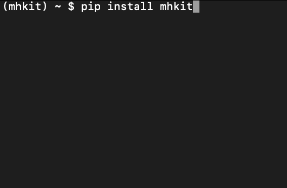
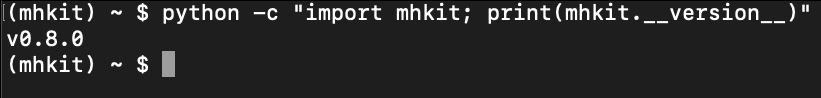
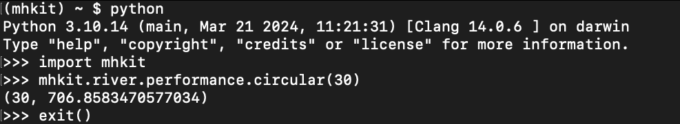
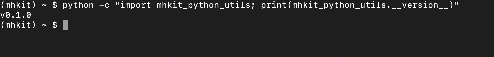
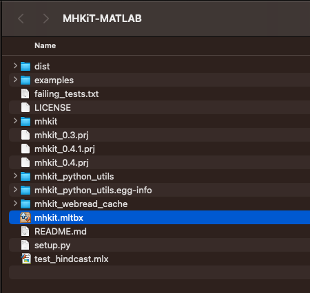
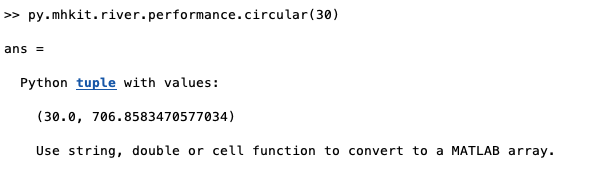

.. _matlab_installation:

MATLAB Installation
===================

The following section includes instructions for installing `MHKiT-MATLAB <https://github.com/MHKiT-Software/MHKiT-MATLAB>`_ .

* New users should follow the :ref:`Installation Steps <installation-section>`.
* Experienced users can follow the :ref:`Advanced Installation Steps <advanced-installation-section>`.

Installation Overview
---------------------

MHKiT-MATLAB utilizes MHKiT-Python to perform many computations and requires installation of Python and MHKiT-Python.

Utilizing MHKiT-Python has the following advantages:

* One standardized codebase that performs computations

  * Bugs fixed in MHKiT-Python are included in MHKiT-MATLAB

  * Features that are added to MHKiT-Python are not reinvented in MHKiT-MATLAB

* Python can leverage scientific computing tools that are not available in MATLAB

The major disadvantage of using Python is difficulty of installation for the MATLAB user. These installation steps provide the simplest path to getting the MATLAB user up and running with MHKiT-MATLAB. Please submit any issues or improvement suggestions to `the MHKiT-MATLAB issues page <https://github.com/MHKiT-Software/MHKiT-MATLAB/issues>`_.

The installation process requires performing the following actions in order:

1. `Install Anaconda <#step-1-install-anaconda>`_
2. `Configure an Anaconda Python Environment <#step-2-configure-an-anaconda-python-environment>`_
3. `Install MHKiT-Python <#step-3-install-mhkit-python>`_
4. `Install MHKiT-MATLAB Python utilities <#step-5-install-mhkit-matlab-python-utilities>`_
5. `Configure MATLAB python environment <#step-6-configure-matlab-python-environment>`_
6. `Install the MHKiT-MATLAB addon <#step-7-install-mhkit-matlab-add-on>`_
7. `Verify MHKiT-MATLAB functionality <#step-8-verify-mhkit-matlab-installation>`_

Required Software
-----------------

* `Anaconda <https://www.anaconda.com/download>`_: Python version and environment manager
* `MATLAB <https://www.mathworks.com/products/matlab.html>`_: Version 2021b and above. The `MHKiT-MATLAB Compatiability Matrix has complete details <https://github.com/MHKiT-Software/MHKiT-MATLAB?tab=readme-ov-file#software-requirements>`_.

.. note::
   Installing and using MHKiT with Anaconda is required for MHKiT-MATLAB. Other types of Python installations may work, but Anaconda provides a standardized Python installation and usage process that works consistently with MATLAB.

.. _installation-section:

Installation Steps
------------------

Step 1. Install Anaconda
"""""""""""""""""""""""""

Download and install `Anaconda <https://www.anaconda.com/download>`_

Step 2. Configure an Anaconda Python Environment
""""""""""""""""""""""""""""""""""""""""""""""""

In this step we are going to create a Python environment within Anaconda which will contain an installation of Python, MHKiT-Python, and the required python packages.

2.1 Launch the "Anaconda Navigator" application

2.2 Navigate to the "Environments" section

.. image:: ./figures/install_anaconda_select_environment_section.png
  :width: 500
  :alt: Navigating to the Anaconda Navigator "Environments" section

2.3 Create a new environment by clicking on the "Create" button

.. image:: ./figures/install_anaconda_create_environment.png
  :width: 500
  :alt: Creating a new Anaconda environment

2.4 Set the environment name and python version to the recommended settings
    * Name: `mhkit`

      * Note: Environments can have any name, but we recommend naming them based on their intended use

    * Packages: Python - Version 3.9 is recommended

      * Note: Check the `MHKiT-MATLAB MATLAB/Python compatiability matrix <https://github.com/MHKiT-Software/MHKiT-MATLAB?tab=readme-ov-file#software-requirements>`_ to verify that the Python version selected is compatiable with your version of MATLAB.

.. image:: ./figures/install_anaconda_setup_environment.png
  :width: 500
  :alt: Setting the parameters a new Anaconda environment

2.5 Create the environment by clicking "Create"
   * This typically takes a few minutes

Step 3. Install MHKiT-Python
""""""""""""""""""""""""""""

3.1 Select the newly create environment by clicking on `mhkit` (the name of your environment)

3.2 Click the play button and select "Open Terminal"

.. image:: ./figures/install_anaconda_open_environment_terminal.png
  :width: 500
  :alt: Opening the terminal for the `mhkit` environment

3.3 Verify that you see ``(mhkit)`` at the beginning of your terminal prompt. This indicates that you are within the Anaconda ``mhkit`` environment. All actions performed within this environment are isolated from other Anaconda and system Python environments.

.. image:: ./figures/install_anaconda_terminal_with_environment_name.png
  :width: 500
  :alt: Detail of terminal with anaconda environment name

3.4 In the terminal input the following command::

	pip install mhkit==0.7.0

And press enter to run this command.

.. Note::
    If this command throws any errors, they must be fixed before proceeding. Please see the installation troubleshooting section below

3.5 Verify your MHKiT-Python version. In the terminal input the following command::

    python -c "import mhkit; print(mhkit.__version__)"

The expected output is the specified `mhkit` version number

3.6 Verify `mhkit` functionality

* Start the python interpreter. In the terminal type::

    python

* Compute the equivalent diameter (ED) and projected capture area (AP) of a circular turbine by running the following code::

    import mhkit
    mhkit.river.performance.circular(30)

The expected output is::

    (30, 706.8583470577034)

Step 4. Download MHKiT-MATLAB Source Code
"""""""""""""""""""""""""""""""""""""""""

4.1 Navigate to the `MHKiT-MATLAB GitHub Repository <https://github.com/MHKiT-Software/MHKiT-MATLAB>`_

4.2. Within the "Code" dropdown menu click on "Download ZIP" to download the repository

.. image:: ./figures/install_github_download_mhkit_matlab_zip.png
  :width: 500
  :alt: Download MHKiT-MATLAB zip file from GitHub

4.3. Unzip the downloaded folder in your preferred installation location.

Step 4. Install MHKiT-MATLAB Python utilities
"""""""""""""""""""""""""""""""""""""""""""""

4.1 Navigate to the MHKiT-MATLAB folder using the terminal

Within the Anaconda environments tab, click the play button and select "Open Terminal"

* Verify that you see `(mhkit)` at the beginning of your terminal prompt.

.. image:: ./figures/install_anaconda_open_environment_terminal.png
  :width: 500
  :alt: Opening the terminal for the `mhkit` environment

4.2 Use pip to install MHKiT-MATLAB Python utilities

* In the terminal type and press enter::

    pip install https://github.com/MHKiT-Software/MHKiT-MATLAB/tarball/master

.. image:: ./figures/install_terminal_pip_mhkit_python_utils.png
  :width: 500
  :alt: Installing mhkit_python_utilities

4.3 Verify your ``mhkit_python_utilities`` version. Expected version is ``0.1.0``

* In the terminal type and press enter::

    python -c "import mhkit_python_utils; print(mhkit_python_utils.__version__)"

Step 5. Configure MATLAB Python Environment
"""""""""""""""""""""""""""""""""""""""""""

5.1 Compute the python executable location

* In the terminal type and press enter::

    python -c "import sys; print(sys.executable)"

And copy the output location:

Typical location on Windows:

* ``C:\ProgramData\anaconda3\envs\mhkit\python.exe``

Typical location on MacOS:

* ``/opt/anaconda3/envs/mhkit/bin/python3``

5.2 Set the Python environment in MATLAB

In the MATLAB command window type the following, replacing `<python executable location>` with the python executable location from above::

    pyenv(Version="<python executable location>")

.. image:: ./figures/install_matlab_python_executable.png
  :width: 500
  :alt: Set MATLAB python executable

Step 6. Install MHKiT-MATLAB Add-On
"""""""""""""""""""""""""""""""""""

6.1 Navigate to the MHKiT-MATLAB directory

6.2. Install the MHKiT-MATLAB Add-On by double clicking on `mhkit.mltbx` toolbox

6.3 Verify add-on is installed

.. image:: ./figures/install_matlab_addons_list.png
  :width: 500
  :alt: MHKiT-MATLAB in MATLAB addons list

Step 7. Verify MHKiT-MATLAB Installation
""""""""""""""""""""""""""""""""""""""""

7.1 In the MATLAB command window type::

    [x, y] = circular(30)

Verify the output is::

    >> [x, y] = circular(30)

    x =

        30

    y =

      706.8583

Congratulations, you now have a working version of MHKiT-MATLAB!

.. _advanced-installation-section:

Advanced Installation
---------------------

1. Install `miniconda <https://docs.anaconda.com/free/miniconda/miniconda-install/>`_.

2. Create an environment for MHKiT-Python:

   * ``conda create -n mhkit python=3.10``
   * ``conda activate mhkit``

3. Install conda dependencies:

   * ``conda install netcdf4 hdf5``

4. Pip install mhkit:

   * ``pip install mhkit==0.7.0``
   * ``python -c "import mhkit; print(mhkit.__version__)"``

     - Should be ``v0.7.0``

   * ``python -c "import mhkit; print(mhkit.river.performance.circular(30))"``

     - The expected output is: ``(30, 706.8583470577034)``

5. Download/clone MHKiT-MATLAB:

   * ``git clone https://github.com/MHKiT-Software/MHKiT-MATLAB.git``

6. Install MHKiT-Python MATLAB Utilities:

   * ``cd MHKiT-MATLAB``
   * ``pip install -e .``

7. Get python executable:

   * Copy output from ``python -e "import sys; print(sys.executable)"``

8. Set the python executable in matlab:

   * In the MATLAB command window:
     * ``pyenv(Version="<python executable path>")``

9. Install the MHKiT-MATLAB "Add-On":

   * In the MHKiT-MATLAB, double click on ``mhkit.mltbx``
   * Verify MHKiT-MATLAB is installed in "Add-Ons"

10. Verify the MHKiT-MATLAB Add-On:

    * In the MATLAB command window execute:
        * ``[x, y] = circular(30)``
    * Verify the output:
        * ``x = 30``
        * ``y = 706.8583``

Troubleshooting
---------------

- Verify you are in the correct Anaconda environment:

  - ``conda activate mhkit``

- Verify MHKiT-Python is working properly:

  - ``python -c "import mhkit; print(mhkit.river.performance.circular(30))"``

  - The expected output is::

        (30, 706.8583470577034)

- Verify your MATLAB ``pyenv`` is pointing to the desired conda python executable:

  - ``pyenv``

    - The expected output is something similar to::

          ans = 

          PythonEnvironment with properties:

                  Version: "3.10"
               Executable: "/opt/anaconda3/envs/mhkit/bin/python3"
                  Library: "/opt/anaconda3/envs/mhkit/lib/libpython3.10.dylib"
                     Home: "/opt/anaconda3/envs/mhkit"
                   Status: Loaded
            ExecutionMode: InProcess
                ProcessID: "29611"
              ProcessName: "MATLAB"

- Check the `MHKiT-MATLAB GitHub Issues <https://github.com/MHKiT-Software/MHKiT-MATLAB/issues>`_
- Check the `MHKiT-Python GitHub Issues <https://github.com/MHKiT-Software/MHKiT-Python/issues>`_
- Submit an issue in the `MHKiT-MATLAB GitHub repository Issue Tracker <https://github.com/MHKiT-Software/MHKiT-MATLAB/issues>`_

