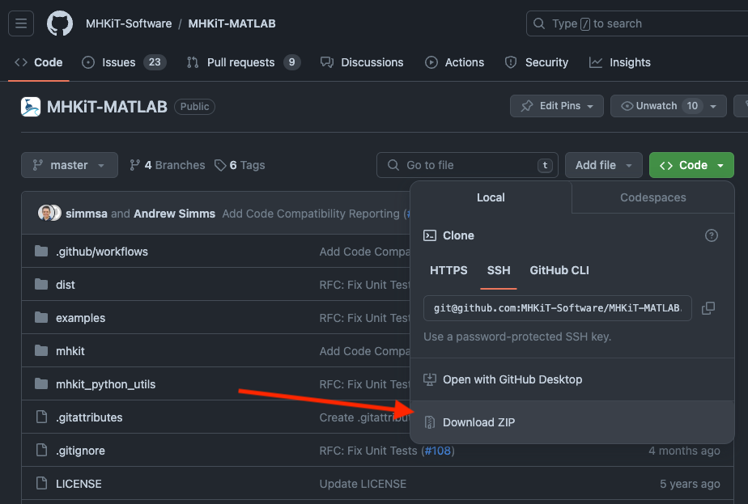
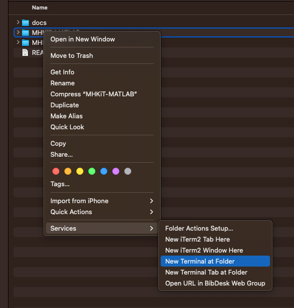
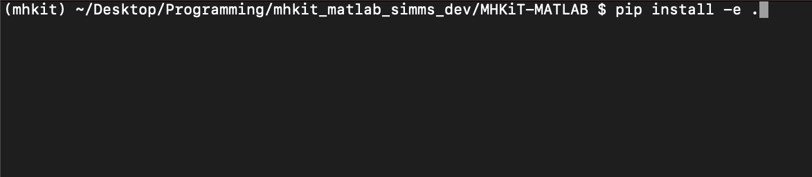
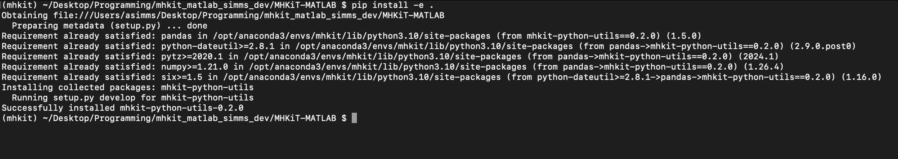

.. _matlab_installation:

MATLAB Installation
===================

The following section includes instructions for installing `MHKiT-MATLAB <https://github.com/MHKiT-Software/MHKiT-MATLAB>`_ .

* New users should follow the :ref:`Installation Steps <installation-section>`.
* Experienced users can follow the :ref:`Advanced Installation Steps <advanced-installation-section>`.

Installation Overview
---------------------

MHKiT-MATLAB utilizes MHKiT-Python to perform many computations and requires installation of Python and MHKiT-Python.

Utilizing MHKiT-Python has the following advantages:

* One standardized codebase that performs computations

  * Bugs fixed in MHKiT-Python are included in MHKiT-MATLAB

  * Features that are added to MHKiT-Python are not reinvented in MHKiT-MATLAB

* Python can leverage scientific computing tools that are not available in MATLAB

The major disadvantage of using Python is difficulty of installation for the MATLAB user. These installation steps provide the simplest path to getting the MATLAB user up and running with MHKiT-MATLAB. Please submit any issues or improvement suggestions to `the MHKiT-MATLAB issues page <https://github.com/MHKiT-Software/MHKiT-MATLAB/issues>`_.

The installation process requires performing the following actions in order:

1. `Install Anaconda <#step-1-install-anaconda>`_
2. `Configure an Anaconda Python Environment <#step-2-configure-an-anaconda-python-environment>`_
3. `Install MHKiT-Python <#step-3-install-mhkit-python>`_
4. `Download MHKiT-MATLAB <#step-4-download-mhkit-matlab>`_
5. `Install MHKiT-MATLAB Python utilities <#step-5-install-mhkit-matlab-python-utilities>`_
6. `Configure MATLAB python environment <#step-6-configure-matlab-python-environment>`_
7. `Install the MHKiT-MATLAB addon <#step-7-install-mhkit-matlab-add-on>`_
8. `Verify MHKiT-MATLAB functionality <#step-8-verify-mhkit-matlab-installation>`_

Required Software
-----------------

* `Anaconda <https://www.anaconda.com/download>`_: Python version and environment manager
* `MATLAB <https://www.mathworks.com/products/matlab.html>`_: Version 2021b and above. The `MHKiT-MATLAB Compatiability Matrix has complete details <https://github.com/MHKiT-Software/MHKiT-MATLAB?tab=readme-ov-file#software-requirements>`_.

.. note::
   Installing and using MHKiT with Anaconda is recommended. Other types of Python installations may work, but Anaconda provides the lowest barrier to entry for the most users.

.. _installation-section:

Installation Steps
------------------

Step 1. Install Anaconda
"""""""""""""""""""""""""

Download and install `Anaconda <https://www.anaconda.com/download>`_

.. note::
    On Windows, the installation of Anaconda3 no longer adds python to the Windows Environment Variables by default. During installation, there is a checkbox in the advanced options of the installation to add it to the system path. The installation wizard advises against doing so in case a user has multiple python installations. Either check this box or setup your environmental variables so that python is accessible through your system path. See `here <https://www.datacamp.com/community/tutorials/installing-anaconda-windows>`_ for more information.

Step 2. Configure an Anaconda Python Environment
"""""""""""""""""""""""""""""""""""""""""""""

In this step we are going to create a Python environment within Anaconda called mhkit

2.1 Launch the "Anaconda Navigator" application

2.2 Navigate to the "Environments" section

.. image:: ./figures/install_anaconda_select_environment_section.png
  :width: 400
  :alt: Navigating to the Anaconda Navigator "Environments" section

2.3 Create a new environment by clicking on the "Create" button

.. image:: ./figures/install_anaconda_create_environment.png
  :width: 400
  :alt: Creating a new Anaconda environment

2.4 Set the environment name and python version to the recommended settings
    * Name: `mhkit`
    * Packages: Python - Version 3.10 is recommended

.. image:: ./figures/install_anaconda_setup_environment.png
  :width: 400
  :alt: Setting the parameters a new Anaconda environment

2.5 Create the environment by clicking "Create"
   * This typically takes a few minutes

Step 3. Install MHKiT-Python
"""""""""""""""""""""""""""""""""

3.1 Select the newly create environment by clicking on `mhkit`

3.2 Click the play button and select "Open Terminal"
    * Verify that you see `mhkit` at the beginning of your terminal prompt.

.. image:: ./figures/install_anaconda_open_environment_terminal.png
  :width: 400
  :alt: Opening the terminal for the `mhkit` environment

3.3 In the terminal input the following command::

	pip install mhkit

And press enter to run this command.

.. image:: ./figures/install_anaconda_terminal_pip_install.png
  :width: 400
  :alt: Installing MHKiT-Python with pip

.. Note::
    If this command throws any errors, they must be fixed before proceeding. Please see the installation troubleshooting section below

3.4 Verify your MHKiT-Python version. In the terminal input the following command::

    python -c "import mhkit; print(mhkit.__version__)"

The expected output is the current `mhkit` version number

.. image:: ./figures/install_anaconda_terminal_version_output.png
  :width: 400
  :alt: Output of `mhkit` version number

3.5 Verify `mhkit` functionality

* Start the python interpreter. In the terminal type::

    python

* Compute the equivalent diameter (ED) and projected capture area (AP) of a circular turbine by running the following code::

    import mhkit
    mhkit.river.performance.circular(30)

The expected output is::

    (30, 706.8583470577034)

.. image:: ./figures/install_anaconda_terminal_mhkit_verify_output.png
  :width: 400
  :alt: Verification of mhkit circular function

Step 4. Download MHKiT-MATLAB
"""""""""""""""""""""""""""""""""

4.1 Navigate to the `MHKiT-MATLAB GitHub Repository <https://github.com/MHKiT-Software/MHKiT-MATLAB>`_

4.2 Download a zip file or clone the repository to your local machine

4.3 Unzip the dowloaded `MHKiT-MATLAB` folder and move it to a preferred location

Step 5. Install MHKiT-MATLAB Python utilities
"""""""""""""""""""""""""""""""""""""""""""""

5.1 Navigate to the MHKiT-MATLAB folder using the terminal

On Windows

Within the Anaconda environments tab, click the play button and select "Open Terminal"

* Verify that you see `mhkit` at the beginning of your terminal prompt.

.. image:: ./figures/install_anaconda_open_environment_terminal.png
  :width: 400
  :alt: Opening the terminal for the `mhkit` environment

* Navigate to the MHKiT-MATLAB folder

  * The easiest way to do this is by using tab completion

    * Begin by typing `cd` <tab>
      * This auto completes directories. Continue auto completing by typing a few characters of the next directory. Add a `\\` (backslash) between folders until your prompt points to the MHKiT-MATLAB directory. Press enter to complete this command.

On MacOS

* View the folder in the Finder, right click > Services > New Terminal 

5.2 Use `pip` to install MHKiT-MATLAB python utilities

* In the terminal type::

    pip install -e .

And press enter

A successful installation should look like the following screenshot:

Step 6. Configure MATLAB Python Environment
"""""""""""""""""""""""""""""""""""""""""""""

6.1 Compute the python executable location

* In the terminal type and press enter::

    python -c "import sys; print(sys.executable)"

And copy the output location:

Typical location on Windows:

* `C:\ProgramData\anaconda3\envs\mhkit\python.exe`

Typical location on MacOS:

* `/opt/anaconda3/envs/mhkit/bin/python3`

6.2 Set the Python environment in MATLAB

In the MATLAB command window type, replace the `<python executable location>` with the python executable location from above::

    pyenv(Version="<python executable location>")

.. image:: ./figures/install_matlab_python_executable.png
  :width: 400
  :alt: Set MATLAB python executable

Step 7. Install MHKiT-MATLAB Add-On
"""""""""""""""""""""""""""""""""""""""""""""

7.1 Navigate to the MHKiT-MATLAB directory

7.2. Install the MHKiT-MATLAB Add-On by double clicking on `mhkit.mltbx` toolbox

.. image:: ./figures/install_matlab_toolbox.png
  :width: 400
  :alt: Install MHKiT-MATLAB toolbox

7.3 Verify add-on is installed

.. image:: ./figures/install_matlab_addons_list.png
  :width: 400
  :alt: MHKiT-MATLAB in MATLAB addons list

Step 8. Verify MHKiT-MATLAB Installation
"""""""""""""""""""""""""""""""""""""""""""""

8.1 In the MATLAB command window type::

    [x, y] = circular(30)

Verify the output is::

    >> [x, y] = circular(30)

    x =

        30

    y =

      706.8583

.. image:: ./figures/install_matlab_verify_mhkit.png
  :width: 400
  :alt: Install MHKiT-MATLAB toolbox

Congratulations, you now have a working version of MHKiT-MATLAB!

.. _advanced-installation-section:

Advanced Installation
---------------------

1. Install `miniconda <https://docs.anaconda.com/free/miniconda/miniconda-install/>`_.

2. Create an environment for MHKiT-Python:

   * ``conda create -n mhkit python=3.10``
   * ``conda activate mhkit``

3. Install conda dependencies:

   * ``conda install netcdf4 hdf5``

4. Pip install mhkit:

   * ``pip install mhkit``
   * ``python -c "import mhkit; print(mhkit.__version__)"``

     - Should be ``v0.8.0`` or similar

   * ``python -c "import mhkit; print(mhkit.river.performance.circular(30))"``

     - The expected output is: ``(30, 706.8583470577034)``

5. Download/clone MHKiT-MATLAB:

   * ``git clone https://github.com/MHKiT-Software/MHKiT-MATLAB.git``

6. Install MHKiT-Python MATLAB Utilities:

   * ``cd MHKiT-MATLAB``
   * ``pip install -e .``

7. Get python executable:

   * Copy output from ``python -e "import sys; print(sys.executable)"``

8. Set the python executable in matlab:

   * In the MATLAB command window:
     * ``pyenv(Version="<python executable path>")``

9. Install the MHKiT-MATLAB "Add-On":

   * In the MHKiT-MATLAB, double click on ``mhkit.mltbx``
   * Verify MHKiT-MATLAB is installed in "Add-Ons"

10. Verify the MHKiT-MATLAB Add-On:

    * In the MATLAB command window execute:
        * ``[x, y] = circular(30)``
    * Verify the output:
        * ``x = 30``
        * ``y = 706.8583``

Troubleshooting
------------------

- Verify you are in the correct Anaconda environment:

  - ``conda activate mhkit``

- Verify MHKiT-Python is working properly:

  - ``python -c "import mhkit; print(mhkit.river.performance.circular(30))"``

- The expected output is::

    (30, 706.8583470577034)

- Check the `MHKiT-MATLAB GitHub Issues <https://github.com/MHKiT-Software/MHKiT-MATLAB/issues>`_
- Check the `MHKiT-Python GitHub Issues <https://github.com/MHKiT-Software/MHKiT-Python/issues>`_
- Submit an issue in the `MHKiT-MATLAB GitHub repository Issue Tracker <https://github.com/MHKiT-Software/MHKiT-MATLAB/issues>`_

